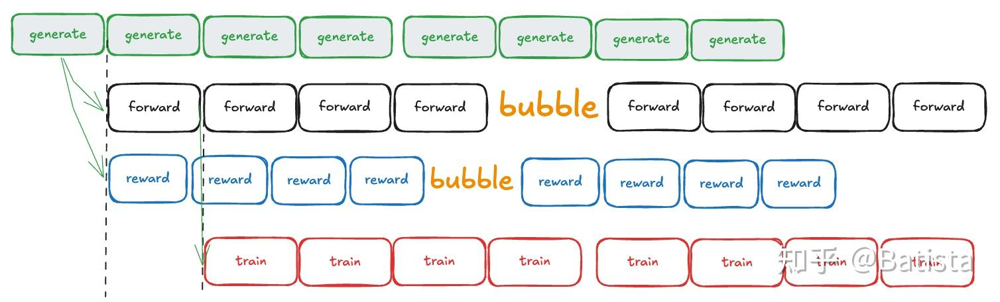
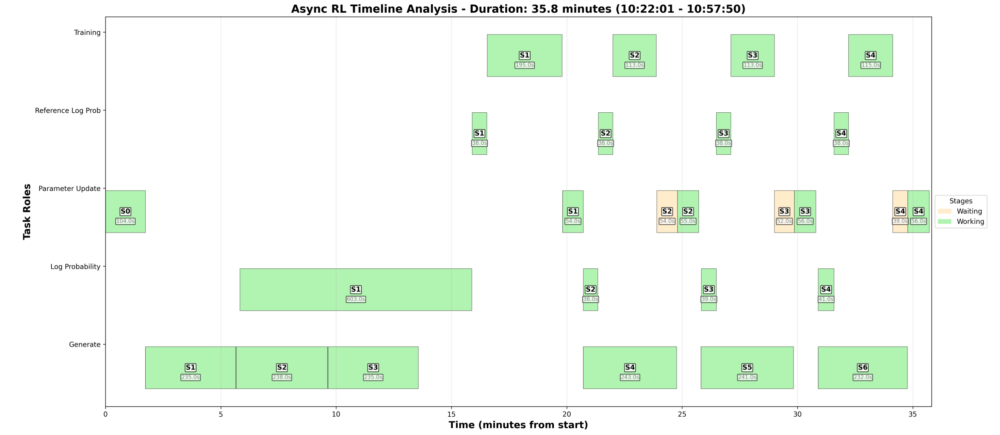
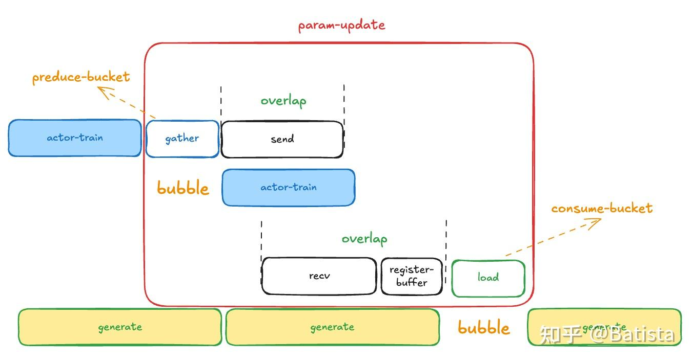
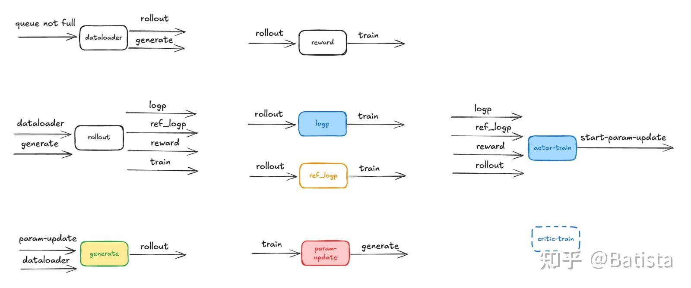
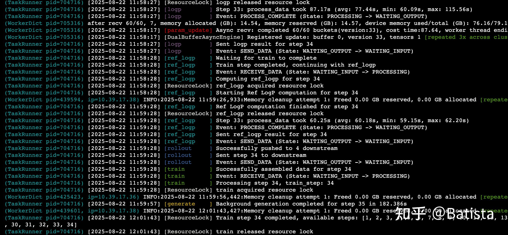

# Async-RL Pipeline based on StateMachine

## Async-RL Architecture

This project introduces a **groundbreaking asynchronous reinforcement learning pipeline** that fundamentally transforms RL training efficiency by completely decoupling traditional synchronous bottlenecks.

**📚 Technical Details**: For comprehensive technical implementation details and design rationale, see our detailed analysis: [**基于状态机的Async-RL(性能提升50%+)**](https://zhuanlan.zhihu.com/p/1941960688944805854)

### 1. Fully Decoupled Architecture

Traditional RL training suffers from synchronous bottlenecks where all components must wait for each other. Our async-RL pipeline **completely decouples** key components:

- **Actor-Train**: Independent training loop execution
- **Actor-Forward-LogP**: Asynchronous log probability computation  
- **Ref_LogP**: Parallel reference log probability calculation
- **Rollout-Generate**: Non-blocking sequence generation

### 2. Asynchronous Parameter Synchronization

We decompose parameter synchronization into three independent phases:
1. **Gather**: NCCL-based parameter aggregation (serial, but optimized)
2. **Send/Recv**: Asynchronous CPU communication
3. **Load**: Non-blocking parameter loading

This enables **true parallelism** between `generate`, `param_update`, and `train` operations.

### 3. Arbitrary Granularity Parallelism

We eliminate RL training bottlenecks through intelligent task overlap:

- **Fast Generation**: Rollout completes quickly while training continues
- **Slow Generation**: Long generate tasks don't block training operations
- **Off-Policy Training**: Enables optimal performance through intelligent scheduling

**Performance Impact**: Up to **125% performance improvement** with optimized configuration and **near-linear scaling (0.9 linearity)**.

### 4. Off-Policy Async Training Flow
The system implements sophisticated off-policy training with asynchronous execution:



**Training Pipeline Stages:**
- **Generate Row (Green)**: 8 parallel generation steps for data creation
- **Forward Row (Black)**: Neural network forward passes with bubble synchronization
- **Reward Row (Blue)**: Reward computation with bubble management
- **Train Row (Red)**: Model training steps using computed rewards

## Performance Results

### Benchmark Configuration
- **Model**: Red-MoE-16B
- **Hardware**: 4 machines  
- **Configuration**: TP1 + PP1 + EP4 + SGLang-TP2
- **Algorithm**: GRPO
- **Batch Size**: 2048

### 🚀 Performance Improvements

**Async-RL achieves over 50% improvement compared to baseline synchronous training**

| time_per_step(s) | 8 | 16 | 32 | 32(async-ref_logp) | 32(tune config) |
|------------------|---|---|----|---------------------|-----------------|
| **verl** | 950s | 500s | 260s | 260s | 260s |
| **async-rl** | x | 270s | 170s | 140s | 120s |
| **speedup** | x | **85%** | **50%** | **85%** | **125%** |

- async-rl overlapped performance
**Update**: 512nGPUs + 340B-moe, async-rl use nccl-sync-overlap can speedup 50% then verl-hybrid-engine.



## Architecture Overview

### Async-RL Pipeline Flow
```
dataloader → generate → rollout → logp/ref_logp → reward → train → param_update
    ↓           ↓         ↓           ↓           ↓        ↓         ↓
  Data      Sequence   Process    Compute    Calculate  Update   Sync
Loading   Generation   Rollout   Log Probs   Rewards   Model    Params
```

### Param-Update Asynchronous Process
The param-update process is decomposed into three independent phases enabling true parallelism:



**Process Stages:**
- **Gather**: NCCL-based parameter aggregation (serial, but optimized)
- **Send/Recv**: Asynchronous CPU communication with overlap phases
- **Load**: Non-blocking parameter loading with consume-bucket mechanism

**Key Features:**
- **Overlap Phases**: Gather/Send and Recv/Register-buffer can overlap
- **Bubble Management**: Intelligent handling of idle periods
- **Bucket Operations**: Preduce-bucket and consume-bucket for efficient data flow
- **Parallel Generate**: Multiple generate operations can run concurrently

### State Machine Architecture
The Async-RL pipeline implements a sophisticated state machine design with interconnected components:



**Core State Machines:**
- **DataloaderStateMachine**: Manages data loading and preprocessing
- **GenerateStateMachine**: Handles sequence generation with interruptible support
- **RolloutStateMachine**: Orchestrates the rollout process
- **LogPStateMachine**: Computes log probabilities for the actor
- **RefLogPStateMachine**: Computes reference log probabilities
- **RewardStateMachine**: Calculates rewards and advantages
- **TrainStateMachine**: Manages the main training loop
- **ParamUpdateStateMachine**: Handles asynchronous parameter updates

**Data Flow Architecture:**
- **Queue Management**: Intelligent queue control with "queue not full" conditions
- **Parallel Processing**: Multiple state machines can operate concurrently
- **State Transitions**: Smooth transitions between different pipeline stages
- **Resource Coordination**: Efficient resource sharing and locking mechanisms

**Color-Coded Components:**
- **Light Blue**: LogP and Actor-Train operations
- **Orange**: Ref-LogP computations
- **Light Green**: Generate operations
- **Light Red**: Param-Update processes
- **White**: Other pipeline components (dataloader, reward, rollout)

### 📋 Training Logs - State Machine Execution
Real-time logs demonstrating the asynchronous execution of different state machines:




## 🔧 Configuration Examples

### Async-RL Pipeline Configuration

**Complete Separation Mode:**
```bash
+trainer.sperated_node_tasks=[logp,ref_logp,actor-train,generate] \
+trainer.sperated_node_ratios=[0.25,0.25,0.25,0.25] \
```

**Hybrid Mode (logp + actor-train grouped):**
```bash
+trainer.sperated_node_tasks=[[logp,actor-train],ref_logp,generate] \
+trainer.sperated_node_ratios=[0.5,0.25,0.25] \
```

**Performance Tuning:**
```bash
+actor_rollout_ref.async_pipeline=True \
# Performance Tuning, enable async-param-update(always True)
+actor_rollout_ref.rollout.enable_dual_buffer=True \
# support: async-cpu or sync-nccl
+actor_rollout_ref.rollout.enable_param_async=False \
# The sender granularity of the actor training node during parameter update
+actor_rollout_ref.rollout.param_update_preduce_bucket_size_mb=2048 \
# The receiver granularity of the rollout inference node is too large, which will cause GPU-OOM
+actor_rollout_ref.rollout.param_update_consume_bucket_size_mb=128 \

# The granularity of offpolicy, 1 means that generate is faster than the train node to execute 1 steps, that is, one-step-offpolicy
+trainer.generate_ahead_steps=1 \
```

## Getting Started

### Quick Installation
```bash
pip install verl
```

### Basic Usage
```python
from verl.trainer.ppo.pipeline import AsyncTrainingFlow

# Initialize the training flow
flow = AsyncTrainingFlow(
    trainer=trainer,
    enable_async_rl=True,
)

# Run the async training
await flow.run()
```

## Upcoming Features

- [x] **Validation Asynchronous Support**: Parallel data streams for training and validation
- [ ] **Critic Asynchronous Support**: Full critic component asynchrony
- [ ] **Off-Policy Monitoring**: Track param_update lag behind actor train-step
- [ ] **Multi-turn rollout and tools**: Advanced optimizations for complex scenarios
- [ ] **Resharding weight for sglang load**: Optimize param-sync's overhead


---

**Async-RL Pipeline**: Revolutionizing reinforcement learning through asynchronous architecture and intelligent resource management. 